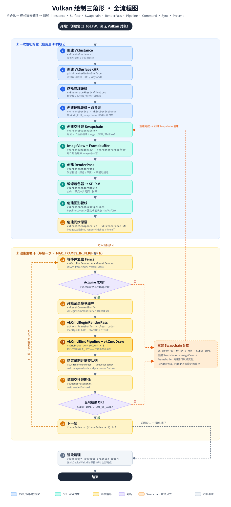

# Learn Vulkan

从Vulkan官方教程开始学习Vulkan API并结合之前学习的LearnOpenGL知识实现一些渲染的Demo

## Hello World - 绘制一个三角形



### 创建VkIntance

```c
vkCreateInstance(
    const VkInstanceCreateInfo*                 pCreateInfo,
    const VkAllocationCallbacks*                pAllocator,
    VkInstance*                                 pInstance);
```

第一个参数是构建