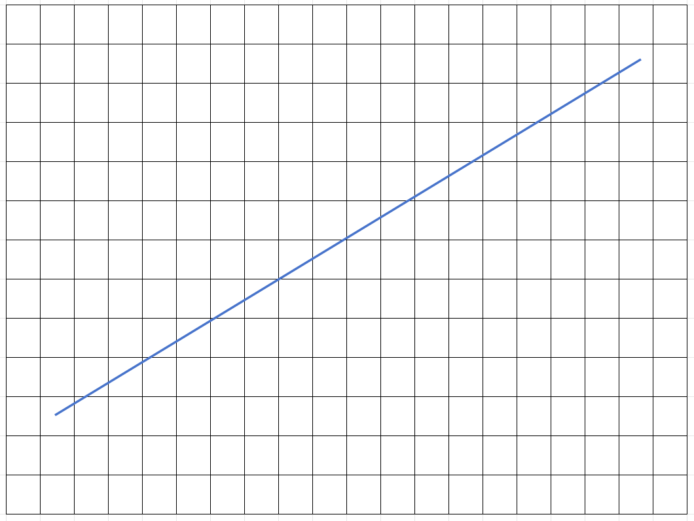
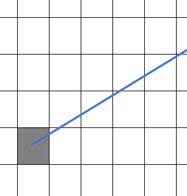

> tinyrenderer网站：https://haqr.eu/tinyrenderer/

## Bresenham直线绘制方法

### 基本思路

把屏幕的像素当作是一个一个的格子，在屏幕上画线就是给N*M范围内的直线路径上的格子进行填充颜色。

如何确定填充哪些格子呢？

---
首先，先画一个虚拟的线段(斜率为0~1的情况)，如下图所示：


<!--    -->

先可以第一个填充起始点(x,y)颜色。

  

然后填充第二个(x+1, y+?)，也就是往x轴方向+1的位置。判断y是否保持还是需要+1。

[TODO]

### 画三角形

根据上面步骤能画出各个方向的直线之后，输入三个点。分别两两相连就能形成一个线框的三角形.

[TODO]

### 加载obj文件

obj文件结构很简单。内容包括了顶点，纹理坐标，法线，组成三角面的数据。

表示顶点的数据以`v`, 纹理坐标以`vt`， 法线坐标以`vn`, 面顶点索引以`f`开头. 都以空格隔开.

```plain
v 0.11526 0.700717 0.0677257
vt  0.167 0.777 0.909
vn  0.347 -0.372 -0.861
f 1429/1493/1429 1426/1490/1426 1425/1489/1425
```

面的数据稍微特殊点，构建模型的最小单位是三角形。而三个顶点组成一个三角形， f的数据就是将顶点，纹理坐标，法线都联系在一起了

```plain
f 1420/1495/1420   1415/1494/1415   1414/3001/1414
   │   │   │         │   │   │        │   │   │
   │   │   └vn[1420] │   │   └vn[1415]│   │   └vn[1414]
   │   └────vt[1495] │   └────vt[1494]│   └────vt[3001]
   └────────v[1420]  └────────v[1415] └────────v[1414]

```

加载模型就是将这些数据每行都读取，然后保存到对应的数组中，以便渲染的时候使用。

### 绘制模型的线框

从上面模型文件中加载的坐标还不能直接绘制到图像上，因为模型文件里的顶点坐标是**模型坐标系下的坐标**。还需要进行一系列的转化：

> 坐标变换可参考： [LearnOpenGL 坐标系统](https://learnopengl-cn.github.io/01%20Getting%20started/08%20Coordinate%20Systems/)

坐标变化流程：
1. 模型转换
```latex
P_world = M_model * P_obj
```
2. 视图变换
```latex
P_view = M_view * P_world
```
3. 投影变换
```latex
P_clip = M_projection * P_view
```
4. 透视除法
```latex
P_ndc = (x_clip / w_clip, y_clip / w_clip, z_clip / w_clip)
```
5. 视口变换
```latex
screen_x = (P_ndc.x * 0.5 + 0.5) * screen_width
screen_y = (0.5 - P_ndc.y * 0.5) * screen_height // Y轴翻转，因为屏幕Y轴正方形向下
```

## 计算 M_view

按照opengl的坐标系，先给一个`[0, 1, 0]`作为向上的方向向量。然后相机位置到目标点位置为前向量。利用前向量和上向量的叉积计算出右向量。由于上向量不一定与前、右向量都是正交的，所以还需要用前向量与右向量进行叉积计算出真正的上向量


```python
import numpy as np

def normalize(v):
    """向量归一化，返回单位向量"""
    norm = np.linalg.norm(v)
    if norm == 0:
        return v
    return v / norm
```


```python
def lookat(eye: np.array, target: np.array, up: np.array) -> np.array:
    f = normalize(target - eye)
    s = normalize(np.cross(f, up))
    u = normalize(np.cross(s, f))

    T = np.array([
        [1, 0, 0, -eye[0]],
        [0, 1, 0, -eye[1]],
        [0, 0, 1, -eye[2]],
        [0, 0, 0,    1   ],
    ])

    R = np.array([
        [ s[0], s[1], s[2], 0],
        [ u[0], u[1], u[2], 0],
        [-f[0],-f[1],-f[2], 0],
        [    0,    0,    0, 0],
    ])

    V = R @ T
    return V
```


```python
# test
eye = np.array([0, 2, -5])
target = np.array([0, 0, 0])
up = np.array([0, 1, 0])
lookat(eye, target, up)
```


    array([[-1.00000000e+00,  0.00000000e+00,  0.00000000e+00,
             0.00000000e+00],
           [ 0.00000000e+00,  9.28476691e-01,  3.71390676e-01,
            -2.22044605e-16],
           [ 0.00000000e+00,  3.71390676e-01, -9.28476691e-01,
            -5.38516481e+00],
           [ 0.00000000e+00,  0.00000000e+00,  0.00000000e+00,
             0.00000000e+00]])


## 计算 M_projection

### 正交视图

正交视图的可视区域是一个规整的正方体。定义一个可视区域范围：l,r(左右), t,b(上下), n,f(前后)的数据组成`[l,r] [t,b] [n,f]`长方体。然后转换到`[-1,1] [-1,1] [-1,1]` 的正方体可视区域内。要计算这个这个变换矩阵，需要先平移到原点，然后进行缩放。

平移矩阵的计算：
1. 计算长方体的中心为： $[\frac{(l+r)}{2}, \frac{(t+b)}{2}, \frac{(n+f)}{2}]$
2. 平移矩阵：将中心点平移到原点，矩阵最后一列应该为负
$$
\begin{bmatrix} 
1 & 0 & 0 & -\frac{l+r}{2} \\ 
0 & 1 & 0 & -\frac{t+b}{2} \\ 
0 & 0 & 1 & -\frac{n+f}{2} \\ 
0 & 0 & 0 & 1 
\end{bmatrix}
$$
3. 缩放矩阵：
需要长方形压缩到正方形的区域，也就是将x,y,z轴方向都缩放到`[-1,1]`范围内。使用线性变换（仿射变换）可以实现：

假设需要将点$P_{view}(x_v, y_v, z_v)$变换到$P_{proj}(x_p, y_p, z_p)$, 先对x方向进行变换：

直线公式为： $f(x) = Ax + B$, 我需要将x的范围压缩到[-1,1], 所以将(l, r)可以带入公式，列出方程：
$$
\begin{cases}
A_x \cdot l + B_x = -1 \\
A_x \cdot r + B_x = 1
\end{cases}
$$
求解出，$A_x=\frac{2}{r-l}$, $B_x=-\frac{r+l}{r-l}$

跟上面同样的方法，计算出y方向的线性公式的系数：
$$
\begin{gathered}
A_y=\frac{2}{t-b},\; B_y=-\frac{t+b}{t-b} \\
A_z=\frac{2}{f-n},\; B_z=-\frac{f+n}{f-n}
\end{gathered}
$$


变换矩阵一般由旋转，缩放，平移的形式组成。但对于目前的变换中没有旋转。可以分两种方式表示，第一种：旋转矩阵乘平移矩阵的到最终的变换矩阵。第二种是直接写变换矩阵。

第一种：

平移矩阵$T$在本章将的前部分已经给出：
$$
T = 
\begin{bmatrix} 
1 & 0 & 0 & -\frac{l+r}{2} \\ 
0 & 1 & 0 & -\frac{t+b}{2} \\ 
0 & 0 & 1 & -\frac{n+f}{2} \\ 
0 & 0 & 0 & 1 
\end{bmatrix}
$$

旋转矩阵R由将前面线性计算的A部分组成

$$
R = 
\begin{bmatrix} 
A_x & 0 & 0 & 0 \\ 
0 & A_y & 0 & 0 \\ 
0 & 0 & A_z & 0 \\ 
0 & 0 & 0 & 1 
\end{bmatrix} =
\begin{bmatrix} 
\frac{2}{r-l} & 0 & 0 & 0 \\ 
0 & \frac{2}{t-b} & 0 & 0 \\ 
0 & 0 & \frac{2}{f-n} & 0 \\ 
0 & 0 & 0 & 1 
\end{bmatrix}
$$

最终的变换矩阵 $M = R \cdot T$， 得到：
$$
\begin{bmatrix} 
\frac{2}{r-l} & 0 & 0 & -\frac{r+l}{r-l} \\ 
0 & \frac{2}{t-b} & 0 & -\frac{t+b}{t-b} \\ 
0 & 0 & \frac{2}{f-n} & -\frac{f+n}{f-n} \\ 
0 & 0 & 0 & 1 
\end{bmatrix}
$$

**第二种方法：**

根据前面线性计算出来的$A_x, B_x, A_y, B_y, A_z, B_z$的内容直接带入到变换矩阵中：
$$
\begin{bmatrix} 
A & B \\ 
0 & 1 
\end{bmatrix}
$$

也可以得到M矩阵：
$$
\begin{bmatrix} 
\frac{2}{r-l} & 0 & 0 & -\frac{r+l}{r-l} \\ 
0 & \frac{2}{t-b} & 0 & -\frac{t+b}{t-b} \\ 
0 & 0 & \frac{2}{f-n} & -\frac{f+n}{f-n} \\ 
0 & 0 & 0 & 1 
\end{bmatrix}
$$


### 透视视图

透视的可视范围是一个四棱台形状，可使范围内的点都要被映射到近平面（透视棱台压扁成长方体）。先变换到正交视图下再判断，如果不在可视范围内的点都将被剔除掉。

四棱台的范围为$[l,r] [t,b] [n,f]$，这个跟正交视图是一样的。

计算投影矩阵，首先就要计算透视视图下的点转换成正交视图下的点的变换矩阵，既先从透视视图转正交视图，然后再从正交视图映射到近平面上。上面我们已经计算出了正交视图的变换矩阵。所以我们只要计算透视到正交的矩阵。

$$
P' = M_{ortho} \cdot M_{persp\to ortho} \cdot P_{persp}
$$

---

近平面的点和远平面点上的z轴都是保持n, f不变的。x，y方向的要进行变换。

利用相似三角形，得到x和y方向映射到正交视图下：
$$
\begin{aligned}
\frac{x'}{n} &= \frac{x}{z} \\[2pt]
x' &= x \cdot \frac{n}{z}
\end{aligned}
$$
同理，y方向也是：$y' = y \cdot \frac{n}{z}$

$$
\begin{aligned}
\begin{bmatrix}
x' \\
y' \\
z' \\
1 \\
\end{bmatrix}= M_{persp\to ortho} \cdot
\begin{bmatrix}
x \\
y \\
z \\
1 \\
\end{bmatrix} \\[4pt]
M_{persp\to ortho}
\cdot
\begin{bmatrix}
x \\
y \\
z \\
1 \\
\end{bmatrix}=
\begin{bmatrix}
x' \\
y' \\
z' \\
1 \\
\end{bmatrix}=
\begin{bmatrix}
x \cdot \frac{n}{z} \\
y \cdot \frac{n}{z} \\
? \\
1 \\
\end{bmatrix}=
\begin{bmatrix}
-nx \\
-ny \\
? \\
-z
\end{bmatrix}
\end{aligned}
$$

所以，可以暂时得出矩阵 $M_{persp\to ortho}$：
$$
\begin{bmatrix}
-n & 0 & 0 & 0 \\
0 & -n & 0 & 0 \\
? & ? & ? & ? \\
0 & 0 & -1 & 0 
\end{bmatrix}
$$

将视锥体压扁(persp->ortho)时，第三行$[0,0,A,B]$需要求解.
利用两个边界条件：

1. 近平面(z=n, n<0): 透视除法之后 z值还是 n
$$
\begin{aligned}
w_{clip} &= -z = -n \\[2pt]
\frac{z_{clip}}{w_{clip}} &= \frac{An+B}{-n}=n
\end{aligned}
$$

得到公式(1):$An+B=-n^2$

2. 远平面(z=f, f<0)：透视除法之后 z值还是 f
$$
\begin{aligned}
w_{clip} &= -z = -f \\[2pt]
\frac{z_{clip}}{w_{clip}} &= \frac{An+B}{-f}=f
\end{aligned}
$$

得到公式(1):$Af+B=-f^2$

由(1)、(2)公式，求解出：$A=-(n+f), B=nf$

然后带入到矩阵中，可得出完成矩阵:
$$
\begin{bmatrix}
-n & 0 & 0 & 0 \\
0 & -n & 0 & 0 \\
0 & 0 & -(n+f) & nf \\
0 & 0 & -1 & 0 
\end{bmatrix}
$$

最终，透视投影的矩阵为：
$$
\begin{aligned}
M = M_{ortho} \cdot M_{persp\to ortho}
&=
\begin{bmatrix} 
\frac{2}{r-l} & 0 & 0 & -\frac{r+l}{r-l} \\ 
0 & \frac{2}{t-b} & 0 & -\frac{t+b}{t-b} \\ 
0 & 0 & \frac{2}{f-n} & -\frac{f+n}{f-n} \\ 
0 & 0 & 0 & 1 
\end{bmatrix}
\cdot
\begin{bmatrix}
-n & 0 & 0 & 0 \\
0 & -n & 0 & 0 \\
0 & 0 & -(n+f) & nf \\
0 & 0 & -1 & 0 
\end{bmatrix} \\[4pt]
&=
\begin{bmatrix} 
\frac{-2n}{r-l} & 0 & \frac{r+l}{r-l} & 0 \\ 
0 & \frac{-2n}{t-b} & \frac{t+b}{t-b} & 0 \\ 
0 & 0 & -\frac{n+f}{n-f} & \frac{2nf}{n-f} \\ 
0 & 0 & -1 & 0 
\end{bmatrix}
\end{aligned}
$$

- FOV的写法

一般使用的适合不会直接写l,r,t,b,n,f。而是用FOV, aspect(宽高比)，所以再转换一层。

$$
\begin{aligned}
\tan\frac{FOV}{2} &= \frac{height/2}{n} \\[2pt]
aspect &= \frac{width}{height}
\end{aligned}
$$

这里的宽高指的是显示画面的宽高（近平面）

$$
\begin{aligned}
height &= t - b \\[2pt]
width &= r - l \\[2pt]
n &= -\frac{height}{2\tan\frac{FOV}{2}} = - \frac{width}{aspect \cdot 2\tan\frac{FOV}{2}}
\end{aligned}
$$

注意： $n=near=z_{near} < 0$

代入到M矩阵中：
$$
\frac{2n}{r-l} = -\frac{1}{aspect \cdot \tan\frac{FOV}{2}}
$$

$$
\frac{2n}{t-b} = -\frac{1}{\tan\frac{FOV}{2}}
$$

$$
\begin{bmatrix}
\frac{1}{aspect \cdot \tan\frac{FOV}{2}} & 0 & \frac{r+l}{r-l} & 0 \\ 
0 & \frac{1}{\tan\frac{FOV}{2}} & \frac{t+b}{t-b} & 0 \\ 
0 & 0 & \frac{n+f}{n-f} & -\frac{2nf}{n-f} \\ 
0 & 0 & -1 & 0 
\end{bmatrix}
$$

如果 剪裁范围的左右，上下是对称的，那么

$$
\begin{aligned}
\frac{r+l}{r-l} &= 0 \\[2pt]
\frac{t+b}{t-b} &= 0
\end{aligned}
$$
既，透视矩阵可简化为：
$$
\begin{bmatrix}
\frac{1}{aspect \cdot \tan\frac{FOV}{2}} & 0 & 0 & 0 \\ 
0 & \frac{1}{\tan\frac{FOV}{2}} & 0 & 0 \\ 
0 & 0 & \frac{n+f}{n-f} & -\frac{2nf}{n-f} \\ 
0 & 0 & -1 & 0 
\end{bmatrix}
$$


## 三角形光栅化

填充三角形像素点，关键点在于判断像素点是在三角形区域的内部还是外部。判断的方式是：

假设当前需要判断的点$P (P_x, P_y)$, 当前三角形的三个点分别为$P1(P1_x, P1_y)$, $P2(P2_x,P2_y)$, $P3(P3_x, P3_y)$。求$P1P$与$P2P1$，$P2P$与$P3P2$, $P3P$与$P1P3$三个的叉积。如果得出的三个叉积都是同符号的说明该点在三角形内部，如果不是同符号的，则说明该点在三角形外部。

利用这个的方法遍历整个画面的像素点，就可以求出在三角形内部的像素点集合。但如果每次传入的三角形都用这么遍历整个画面的像素点，代价很大。可以缩小遍历的范围来进行优化。

首先可以计算出三角形三个点的x,y方向的最大和最小的值，然后形成一个$(x_{min}, y_{min}), (x_{max}, y_{max})$的包围盒，只遍历包围盒内的像素。

## 重心坐标法插值计算

这个部分也是在三角形光栅化阶段来处理的。以当前像素点（三角形内部）与三角形的三个顶点划分的三个小三角形，然后计算每个小三角形面积与整个三角形面积的比例。然后用这些将三个顶点数据的值按照这个比例进行配比就形成了该像素点插值后的属性值。

在我的代码中，为了能让模拟顶点着色器函数内设置自定义的数据也能插值之后传给模拟片段着色器函数使用。我用了一个Varying类来抽象着色器属性，然后对不同的数据组合写不同的插值函数，达到自定义属性也能方便的插值的作用。

## 背面剔除

这是一个优化的选项，只有模型正面才能被看得见，整个模型所有三角形渲染过于奢侈，在图元装配阶段的就可以丢弃掉模型背面的三角形来减少计算的压力。由于我写的管线流程忽略的图元装配阶段，直接就是按照OpenGL中的GL_TRIANGLES来实现的，图元装配阶段的剪裁，透视除法，视口变换都放到模拟光栅化函数的前面处理。

从模拟的顶点着色器传到光栅化的顶点是由输入顺序的，p1, p2, p3点。$P'=p2 - p1$, $P''=p3 - p2$。对两个向量进行叉积计算，得到的结果是正，说明该三角形是当前模型的正面继续光栅化处理，否则是背面则放弃处理该三角形。

## 简易摄像机控制

教程中作者是在原本正交视角的基础上进行修改，实现了一个简单的透视相机，将近平面的点利用相似三角形的方式映射到了远平面，距离相机越近的面投射到远处会变得越大，距离越远的面越会保持大小不变，从而实现了近大远小的效果。但实际上OpenGL中的透视视角实现方式是以近平面的大小为基准，将远平面部分进行压缩实现的近大远小。具体可参考 计算 M_projection 章节。

## 优化摄像机

参考前面 计算 M_view, M_projection 章节

## 着色

实现了非常经典得着色算法：Blinne-Phong。看LearnOpenGL上得 基础光照/光照，高级光照/Blinn-Phong两章节花费了一些功夫，算法直接现抄得。

## 更多数据

- 法线贴图结合重心插值法获得更细腻得光照效果
- 实现纹理采样，使用漫反射，高光贴图获得更丰富得材质效果

纹理滤波只实现了最近邻算法，没有实现双线性插值，三线性插值，以及mipmap

## 切线空间法向量映射

直接使用世界空间的法线贴图会出现一个问题，如果模型不做变换那法线贴图能正常适配该模型，当模型发生了变换之后与法线贴图之间的映射就会乱掉。为了解决这个问题，在建模软件里面输出法线贴图的实话就要选择切线空间的法线贴图，这种贴图的方式是基于局部的切线空间来映射的，要使用的时候要将切线空间转换到世界空间，这样能让模型变换之后也能映射正确。

---

教程中已经给出了切线空间的法线贴图(*_nm_tangent.tga)，第一步则是在导入的时候构建TBN矩阵。

首先介绍一下什么是TBN矩阵。T表示切线向量，B表示副切线向量，N表示法线向量。简单说就是计算模型三角形顶点的向量与映射到纹理上的向量的变换矩阵。


## 阴影映射

先获取灯光视角下的深度图，然后再将深度视角下的深度度传入到正常视角的顶点着色器中，将点通过灯光视角投影矩阵转换到灯光视角的坐标系中，然后对深度进行比较。如果小于其深度则应该是亮的地方，如果大于深度则应该是暗的地方。

---

1. 改造渲染流程。
    - 第一个pass用来渲染深度图，第二个pass将深度图传入到vertex和fragment的shader中及性能计算。 
    - 平铺的方式先pass 1的代码，然后pass 2的代码。
    - 用renderpipleline::begin_frame()来界定一个pass阶段的开始。
2. 改造相机用正交视角的方式渲染深度图。
    - 重新计算lookat矩阵，用灯光的方向向量去计算
    - 封装了设置通用的unform参数之类的函数
    - 还加了一个按键D 用来可视化获取的深度图
3. vertex改造
4. fragment改造


## 环境光遮蔽

## 使用rust实现的源码

https://github.com/taoxianpeng/tinyrenderer_rs
