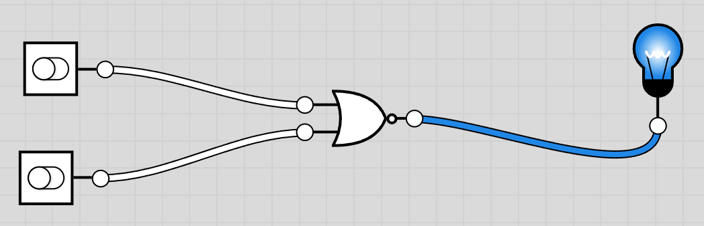
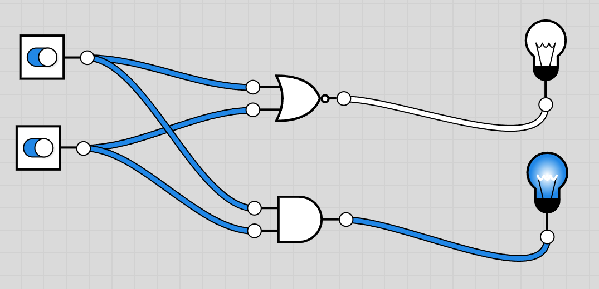

# 全加器门电路

## 半加器实现

以加法器电路举例说明。先不考虑低位进位，只写出两个加数 $A$、$B$ 相加时的变化。

本位和 $S$ 的真值表：

| $A$ | $B$ | $S$（本位和） |
| :-: | :-: | :-----------: |
|  0  |  0  |       0       |
|  0  |  1  |       1       |
|  1  |  0  |       1       |
|  1  |  1  |       0       |

进位 $C$ 的真值表：

| $A$ | $B$ | $C$（进位） |
| :-: | :-: | :---------: |
|  0  |  0  |      0      |
|  0  |  1  |      0      |
|  1  |  0  |      0      |
|  1  |  1  |      1      |

由上面两表可直接写出两个输出的逻辑表达式：

$$S = A \oplus B$$

$$C = AB$$

从公式和真值表中可以看出来，本位和可以用异或门电路，进位是一个与门电路来进行计算。用图表的方式可以这样表示：

此时实现的就是半加器门电路。再次基础上将进位传递到下一个位的加法电路上就是全加器。区别是，半加器只接受两个输入（相加），全加器是接受三个输入（要包括上一位的进位）

## 全加器实现

## 卡诺门电路简化
